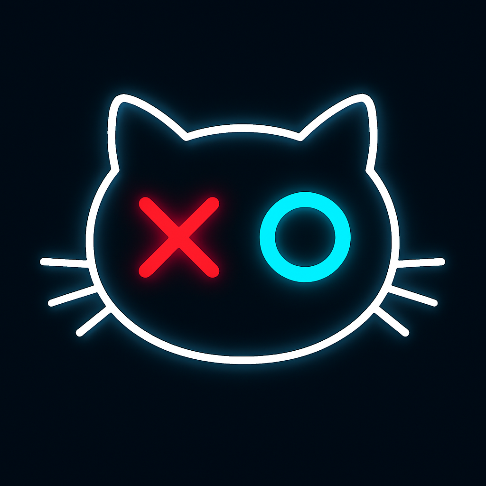

# Tic-Tac-Toe Wear OS & Mobile App

## Descripción General

Este proyecto es una implementación completa de un juego del Gato (Tic-Tac-Toe) diseñado para funcionar de forma sincronizada entre un dispositivo móvil Android y un reloj inteligente con Wear OS. La aplicación demuestra una arquitectura moderna de desarrollo de Android, el uso de Jetpack Compose para interfaces de usuario adaptativas y la comunicación en tiempo real entre dispositivos a través de la API de Datos Portables de Google.

---

### Formato del Mensaje de Comunicación

La comunicación entre dispositivos no utiliza un mensaje genérico de "respuesta", sino un **formato de datos específico y minimalista** para transmitir cada jugada. Esto asegura una comunicación rápida y eficiente.

-   **Ruta del Mensaje:** Todos los mensajes se envían a través de la ruta `/tic_tac_toe_move`.
-   **Formato del Mensaje:** Es una cadena de texto (`String`) simple que sigue la estructura: `"[JUGADOR],[FILA],[COLUMNA]"`.
    -   **Ejemplo de una jugada:** `"X,0,1"` indica que el jugador 'X' ha marcado la casilla en la primera fila, segunda columna.
    -   **Ejemplo de un reinicio:** `"EMPTY,-2,-2"` es un código especial que se usa para notificar al otro dispositivo que la partida se ha reiniciado.
-   **Indicación:** En lugar de un mensaje general como "Puntaje del Wearable", cada mensaje es una **instrucción directa** que le dice a la aplicación receptora: "El otro jugador ha realizado este movimiento exacto. Actualiza tu estado de juego para reflejarlo". La lógica para determinar el ganador, el empate o el siguiente turno se ejecuta localmente en cada dispositivo después de procesar esta instrucción.

## 1. Vinculación y Comunicación entre Dispositivos

La comunicación entre la aplicación del móvil y la del reloj se realiza a través de la **API de Datos Portables (Wearable Data Layer API)** de los Servicios de Google Play.

- **Mecanismo:** Se utiliza el `MessageClient` para enviar mensajes cortos y el `NodeClient` para identificar los dispositivos conectados.
- **Funcionamiento:**
    1. Cuando un jugador realiza un movimiento en un dispositivo, la aplicación empaqueta la información de la jugada (jugador, fila y columna) en un mensaje de texto simple (ej. `"X,1,1"`).
    2. Este mensaje se envía a través de la API por una ruta predefinida (`/tic_tac_toe_move`).
    3. El otro dispositivo tiene un servicio en segundo plano (`DataLayerListenerService`) que está escuchando constantemente en esa ruta.
    4. Al recibir el mensaje, el servicio lo decodifica y actualiza el estado del juego en su propio `GameViewModel`, haciendo que la interfaz se refresque con la nueva jugada.
- **Configuración Clave:** En el `AndroidManifest.xml`, fue crucial añadir el bloque `<queries>` para permitir que la app busque el dispositivo Wear OS y declarar el `<service>` para que el sistema pueda iniciar el `DataLayerListenerService` al recibir un mensaje.

## 2. Funcionalidad Principal

- **Juego Sincronizado:** La característica principal es que el estado del tablero es compartido. Un movimiento en el reloj se refleja instantáneamente en el móvil y viceversa.
- **Interfaz Adaptativa:** La UI, construida 100% con Jetpack Compose, se adapta a cada pantalla, usando `androidx.wear.compose` en el reloj y `androidx.compose.material` en el móvil, pero compartiendo la misma lógica y estilos.
- **Modo de Prueba (`isDebugMode`):** Se implementó una variable booleana en el `GameViewModel` que permite jugar una partida completa en un solo dispositivo (móvil o reloj), controlando a ambos jugadores, lo cual es fundamental para el desarrollo y la depuración.

## 3. Arquitectura y Código Fuente

El proyecto sigue una arquitectura moderna **MVVM (Model-View-ViewModel)**.

- **`GameViewModel.kt` (ViewModel):** El "cerebro" de la aplicación. Contiene todo el estado del juego y centraliza la lógica de negocio.
- **`GameScreen.kt` (View):** Contiene todos los elementos visuales de la interfaz. No tiene lógica propia, solo muestra el estado del `GameViewModel`.
- **`MainActivity.kt` (View/Controller):** Su responsabilidad es mínima: crear el `GameViewModel`, inyectarle las dependencias (`MessageClient` y `NodeClient`) y conectar el `ViewModel` con la `GameScreen`.
- **`DataLayerListenerService.kt` (Model/Data Layer):** Es el servicio que corre en segundo plano para escuchar los mensajes del otro dispositivo y actualizar el `GameViewModel`.
- **`GameViewModelHolder.kt`:** Un objeto simple (singleton) que actúa como "puente" para que el `DataLayerListenerService` pueda encontrar la instancia del `ViewModel` que la `MainActivity` está usando.

## 4. Archivos Ejecutables

El proyecto genera dos APKs, uno para cada módulo:

- **APK para Móvil:** Se encuentra en `mobile/build/outputs/apk/debug/mobile-debug.apk`.
- **APK para Reloj:** Se encuentra en `wear/build/outputs/apk/debug/wear-debug.apk`.

Para generarlos, se debe usar la opción **Build > Build Bundle(s) / APK(s) > Build APK(s)** en Android Studio.

## 5. Configuración de Herramientas (Gradle)

- **`build.gradle.kts` (por módulo):** Se configuraron dependencias de Jetpack Compose distintas para cada módulo, se habilitaron las `buildFeatures` para Compose y se añadió el plugin del compilador de Kotlin.
- **`gradle/libs.versions.toml` (Catálogo de Versiones):** Se utilizó para gestionar todas las dependencias y sus versiones de forma centralizada, añadiendo librerías faltantes como `lifecycle-viewmodel-compose` y `kotlinx-coroutines-play-services`.

## 6. Configuración de Emuladores

- **Emparejamiento:** Se requiere un emulador de teléfono y uno de Wear OS, emparejados a través del **Device Manager** de Android Studio.
- **Solución de Problemas Comunes:**
    - **`device offline`:** Solucionado con la opción **"Cold Boot Now"** en el Device Manager.
    - **`INSTALL_FAILED_USER_RESTRICTED`:** Solucionado habilitando la **"Depuración por USB"** e **"Instalar vía USB"** en las opciones de desarrollador del dispositivo.
    - **Emparejamiento con Teléfono Físico:** Se logra redirigiendo el tráfico con el comando `adb -d forward tcp:5601 tcp:5601`.
